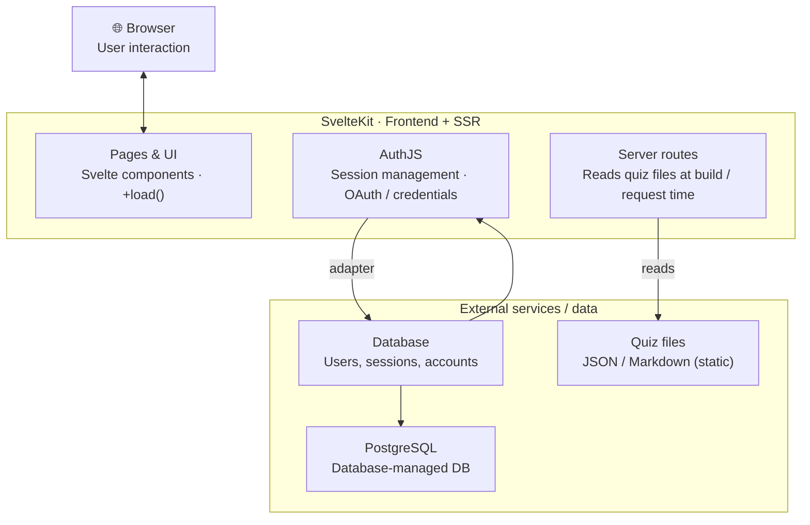

# Quiz

### Desarrollo

1. Crea un copia de la base de datos SQLite

```bash
cp ./dev/database.sqlite ./database.local.sqlite
```

### Arquitectura


```mermaid
flowchart TD
    Browser["🌐 Browser\nUser interaction"]

    subgraph SK["SvelteKit · Frontend + SSR"]
        UI["Pages & UI\nSvelte components · +load()"]
        Auth["AuthJS\nSession management · OAuth / credentials"]
        Server["Server routes\nReads quiz files at build / request time"]
    end

    subgraph External["External services / data"]
        Database["Database\nUsers, sessions, accounts"]
        PG["PostgreSQL\nDatabase-managed DB"]
        Quizzes["Quiz files\nJSON / Markdown (static)"]
    end

    Browser <--> UI
    Auth -- "adapter" --> Database
    Database --> Auth
    Server -- "reads" --> Quizzes
    Database --> PG
```
